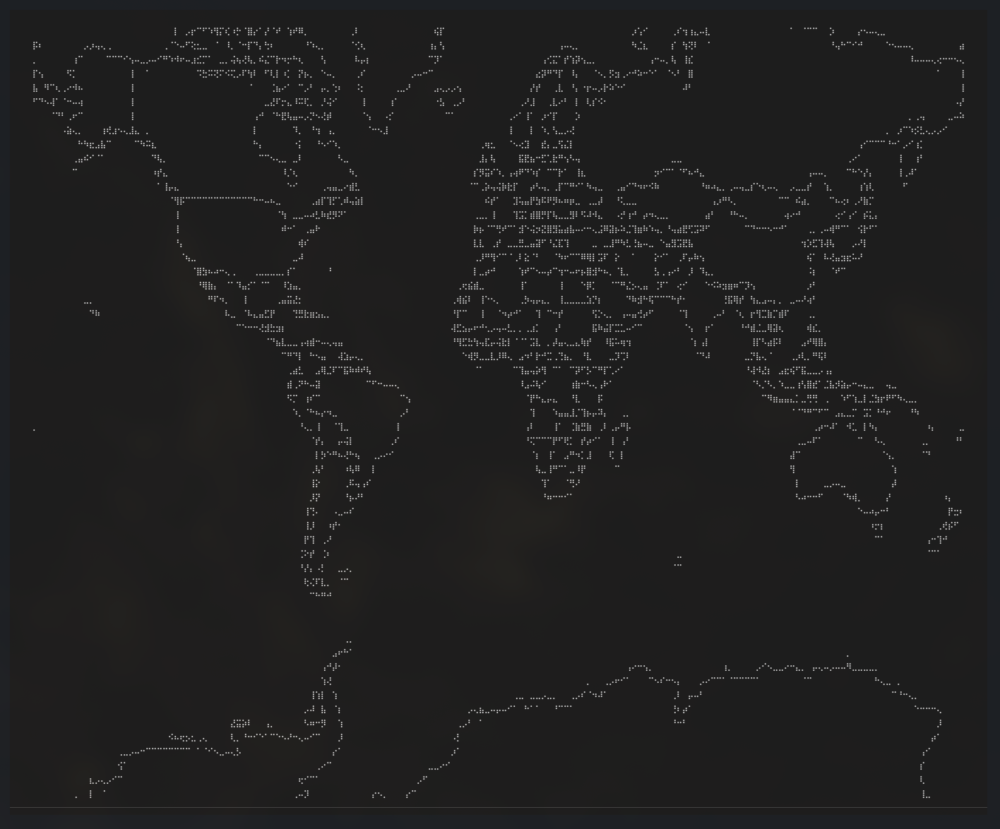

# Geo-TUI


A textual TUI (Text User Interface) application for viewing world maps with interactive navigation.

## Features

- **Interactive Map Viewing**: View world maps rendered using Unicode Braille characters for high resolution
- **Pan and Zoom**: Navigate the map using arrow keys and zoom controls
- **Data Updates**: Interface for updating map data at specific lat/lon coordinates

## Architecture

The project follows clean architecture principles with clear separation of concerns:

```
src/geo_tui/
├── domain/              # Core business logic
│   ├── entities/        # Domain entities (Viewport, MapPoint, etc.)
│   └── interfaces/      # Abstract interfaces (Projection, Renderer, etc.)
├── infrastructure/      # External concerns
│   ├── projection/      # Coordinate projection implementations
│   ├── geometry/        # Geometry loading (GeoPandas)
│   └── rendering/       # Rendering implementations (Braille)
├── application/         # Use cases and services
│   ├── services/        # Application services
│   └── use_cases/       # Business use cases
└── presentation/        # UI layer
    └── widgets/         # Textual widgets
```

## Installation

### Basic Installation (Recommended)

For basic usage with GeoJSON files (no system dependencies required):

```bash
uv sync
```

This installs core dependencies without geopandas, avoiding GDAL system library requirements.

### Full Installation (with geopandas)

For full functionality including Natural Earth dataset support:

```bash
uv sync --extra geopandas
```

**Note**: This requires system-level GDAL libraries. See [INSTALL.md](INSTALL.md) for platform-specific instructions.

### Development Setup

```bash
uv sync --extra all
```

## Usage

### Using the installed command (recommended):

```bash
# Basic usage with GeoJSON file
uv run geo-tui data/globe.geo.json

# Or let it find data/globe.geo.json automatically
uv run geo-tui
```

### With geopandas (uses Natural Earth dataset):

```bash
uv sync --extra geopandas
uv run geo-tui
```

### Alternative: Direct Python execution

```bash
# Using main.py directly
uv run python main.py data/globe.geo.json

# Or
uv run python main.py
```

The application will automatically use `data/globe.geo.json` if available, otherwise it requires geopandas for the Natural Earth dataset.

## Controls

- **W, A, S, D**: Pan the map (W=up, S=down, A=left, D=right)
- **]**: Zoom in
- **[**: Zoom out
- **r**: Reset viewport to default position
- **Ctrl+Q**: Quit the application

## Data Format

The application accepts GeoJSON files with country/polygon data. By default, it uses the Natural Earth lowres dataset bundled with GeoPandas. You can provide your own GeoJSON file as a command-line argument.

## Development

### Running Tests

```bash
pytest
```

With coverage:

```bash
pytest --cov=src/geo_tui --cov-report=html
```

### Project Structure

- **Domain Layer**: Core entities and interfaces (no external dependencies)
- **Infrastructure Layer**: Implementations of domain interfaces (GeoPandas, PyProj, etc.)
- **Application Layer**: Business logic and use cases
- **Presentation Layer**: Textual UI components

### Extending the Application

The architecture is designed for extensibility:

1. **Add new projections**: Implement the `Projection` interface
2. **Add new renderers**: Implement the `Renderer` interface
3. **Add new data sources**: Implement the `GeometryLoader` interface
4. **Add new use cases**: Create new use case classes in `application/use_cases/`

## Dependencies

- `textual`: TUI framework
- `rich`: Rich text and beautiful formatting
- `geopandas`: Geographic data manipulation
- `shapely`: Geometric operations
- `pyproj`: Coordinate transformations
- `rtree`: Spatial indexing

## License

This project is open source and available under the MIT License.

